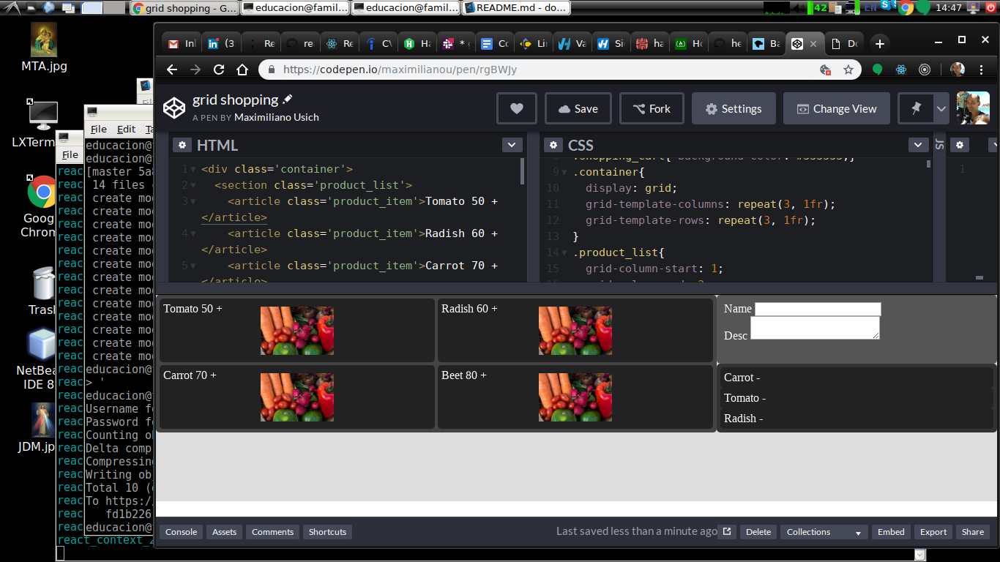

# doc20_fp 

## From Zero environment, one step docker-compose react

### First, create an empty reposotory 

#### Functional Programming in Javascript is the focus in this guide.

Using bitbucket, and git clone localy.

```
educacion@family:~/src$ git clone https://bitbucket.org/maximilianou/doc20_fp.git
```

Adding .gitignore to Nodejs project

```
educacion@family:~/src/doc20_fp$ cp ~/Downloads/Node.gitignore.txt .gitignore
```

Upload changes to the default online repository.

```
educacion@family:~/src/doc20_fp$ git add .
educacion@family:~/src/doc20_fp$ git commit -m 'gitignore added'
educacion@family:~/src/doc20_fp$ git push
```

Use default react fast project creator building tool.

```
educacion@family:~/src/doc20_fp$ npx create-react-app products
```

Create a Dockerfile

Use node official, and using node user inside the docker container.

```
educacion@family:~/src/doc20_fp$ vi products/Dockerfile 
educacion@family:~/src/doc20_fp$ cat products/Dockerfile 
FROM node
RUN mkdir -p /opt/app
WORKDIR /opt/app
COPY . /opt/app
RUN chown -R node:node /opt/app
USER node
CMD ["npm", "run", "start"]
```

Creating the docker-compose.yml

Creating this composer will help running multiple services.

One service as starting point.

( Here is hardcoded the port inside the docker-compose,
  and this configuration have to be in the .env,
  to run in stage or testing or production environment )

```
educacion@family:~/src/doc20_fp$ cat docker-compose.yml 
version: '3.7'
services:
  fp_front: 
    container_name: fp_front
    build: 
      context: ./products/.
      dockerfile: Dockerfile 
    volumes:
      - './products:/opt/app'
      - './products/node_modules:/opt/app/node_modules'
    ports:
      - '3333:3000'
    environment:
      - NODE_ENV=development
```

Now run the docker-compose, 

this have to build the docker image, 

to rebuild use docker-compose build only if needed.


```
educacion@family:~/src/doc20_fp$ docker-compose up

educacion@family:~/src/doc20_fp$ docker-compose down
```

#### Conclusion

This are the minimal steps to start using react, in an environment. 

Here trying to write down Functional Programming Code.


------------------------------------------------------------------------------------------

## From Zero, one step docker-compose react nextjs

### Next have to simplify something

Starting in a new directory or folder

```
educacion@family:~/src/doc20_fp$ mkdir articles
educacion@family:~/src/doc20_fp$ cd articles
educacion@family:~/src/doc20_fp/articles$ npm init -y
educacion@family:~/src/doc20_fp/articles$ npm install react react-dom next
educacion@family:~/src/doc20_fp/articles$ mkdir pages
```

Taking a look at the minimal package.json, to see future changes.

```
educacion@family:~/src/doc20_fp$ cat articles/package.json 
{
  "name": "articles",
  "version": "1.0.0",
  "description": "",
  "main": "index.js",
  "scripts": {
    "dev":   "next",
    "build": "next build",
    "start": "next start",
    "test":  "echo \"Error: no test specified\" && exit 1"
  },
  "keywords": [],
  "author": "",
  "license": "ISC",
  "dependencies": {
    "next": "^8.1.0",
    "react": "^16.8.6",
    "react-dom": "^16.8.6"
  }
}
```
Having the simplest FP index.js

```
educacion@family:~/src/doc20_fp$ cat articles/pages/index.js 
const Index = () => (
  <div>
     <p>One Article Index</p>
  </div>
)
export default Index;
```

Having the simplest FP about.js

```
educacion@family:~/src/doc20_fp$ cat articles/pages/about.js 
const About = () => {
  return (    
        <div>
            <p>About Articles Next</p>
        </div>
  )
}
```
Creating the Dockerfile, to have isolated the environment of this service

```
educacion@family:~/src/doc20_fp$ cat articles/Dockerfile 
FROM node
RUN mkdir -p /opt/app
WORKDIR /opt/app
COPY . /opt/app
RUN chown -R node:node /opt/app
USER node
CMD ["npm", "run", "dev"]
```
Changing the docker-compose.yml to run everything at once, for development environment

```
educacion@family:~/src/doc20_fp$ cat docker-compose.yml 
version: '3.7'
services:
  fp_front: 
    container_name: fp_front
    build: 
      context: ./products/.
      dockerfile: Dockerfile 
    volumes:
      - './products:/opt/app'
      - './products/node_modules:/opt/app/node_modules'
    ports:
      - '3333:3000'
    environment:
      - NODE_ENV=development

  articles_front: 
    container_name: articles_front
    build: 
      context: ./articles/.
      dockerfile: Dockerfile 
    volumes:
      - './articles:/opt/app'
      - './articles/node_modules:/opt/app/node_modules'
    ports:
      - '3344:3000'
    environment:
      - NODE_ENV=development
```
Checking the start and stop of the service, with a bash command

```
educacion@family:~/src/doc20_fp$ docker-compose up

educacion@family:~/src/doc20_fp$ curl http://localhost:3344/
educacion@family:~/src/doc20_fp$ curl http://localhost:3344/about

educacion@family:~/src/doc20_fp$ docker-compose down
```

-----------------------------------------------------------------------------------

https://nextjs.org/learn/basics/using-shared-components/rendering-children-components

Having a Header.js FP React Component to use, Link library of next

```
educacion@family:~/src/doc20_fp$ cat articles/comps/Header.js 
import Link from 'next/link'
const linkStyle = {
  marginRight: 15
}
const Header = () => (
  <div>
    <Link href="/">
      <a style={linkStyle}>Home</a>
    </Link>
    <Link href="/about">
      <a style={linkStyle}>About</a>
    </Link>
  </div>
)
export default Header
```
Using the FP React Layout option, 

a function to compose the content into the layout

```
educacion@family:~/src/doc20_fp$ cat articles/comps/MyLayout.js 
import Header from './Header'
const layoutStyle = {
    margin: 10,
    padding: 10,
    border: '1px solid #EEE'
}
const withLayout = Page => {
  return () => (
        <div style={layoutStyle}>
          <Header />
          <Page />
        </div>
  )
}
export default withLayout
```
Now applying the FP Layout to the index,

```
educacion@family:~/src/doc20_fp$ cat articles/pages/index.js 
import withLayout from '../comps/MyLayout'
const Index = () => <p>One Article Index</p> 
export default withLayout(Index)
```
And applying the FP Layout to About page.

```
educacion@family:~/src/doc20_fp$ cat articles/pages/about.js 
import withLayout from '../comps/MyLayout'
const About = () =>  <p>About Articles Next</p>
export default withLayout(About)
```

#### Conclusion
It seems that FP simplifies the code, specialy for maintenance and scalability


------------------------------

## From Zero, one step docker-compose react nextjs router path

### Routing with NextJS in FP React Components

Here we have the router of next.

Using FP seems to be clear, and uncoupled!

```
educacion@family:~/src/doc20_fp$ cat articles/pages/index.js 
import withLayout from '../comps/MyLayout'
import { withRouter } from 'next/router'
const Routing = withRouter( props =>  ( <h1>{props.router.query.title}</h1> ) )
const Index = () => 
    (
      <div>
        <Routing />
        <p>One Article Index</p> 
      </div>
    ) 
export default withLayout(Index)
```

Now checking with bash, if the content is in place > 0 , or not === 0

```
educacion@family:~/src/doc20_fp$ curl http://localhost:3344/?title=Running%20with%20parameters | grep "Running" | wc -l
1
```

In this part, looking at the official tutorial, 

it's cleaning the path, 

to clean CGI url parameters

```
educacion@family:~/src/doc20_fp$ cat articles/pages/blog.js 
import Link from 'next/link'
import withLayout from '../comps/MyLayout.js';
const PostLink = props => (
  <li>
    <Link as={`/p/${props.id}`} href={`/post?title=${props.title}`}>
      <a>{props.title}</a>
    </Link>
  </li>
)
const Blog = () => (
    <div>
      <h1>My Blog</h1>
      <ul>
        <PostLink id="starting-next" title="Starting Next.js" />
        <PostLink id="learning-nextjs" title="Learn Next.js is awesome" />
        <PostLink id="deploying-nextjs" title="Deploying next apps" />
      </ul>
    </div>
)
export default withLayout(Blog)
```
And Bash Checking the content of the page.

```
educacion@family:~/src/doc20_fp$ curl http://localhost:3344/blog | grep "Starting" | wc -l
```
#### Conclusion
This Functional Programming approach seems to be scalable, maintenable, clear to read.
But nextjs have something.. like library dependency, an library learning.. code smell.

I'll try to complete, this step by step, for a functional example solution to have.


### React like Redux, Context Api Reducer

( here i left next and redux, there is a simple way, up to now )

#### Starting shopping cart layout, first steps

Reference: https://developer.mozilla.org/en-US/docs/Web/CSS/CSS_Grid_Layout/Basic_Concepts_of_Grid_Layout

Tool: https://codepen.io/maximilianou/pen/rgBWJy




##### to be continued.. 

